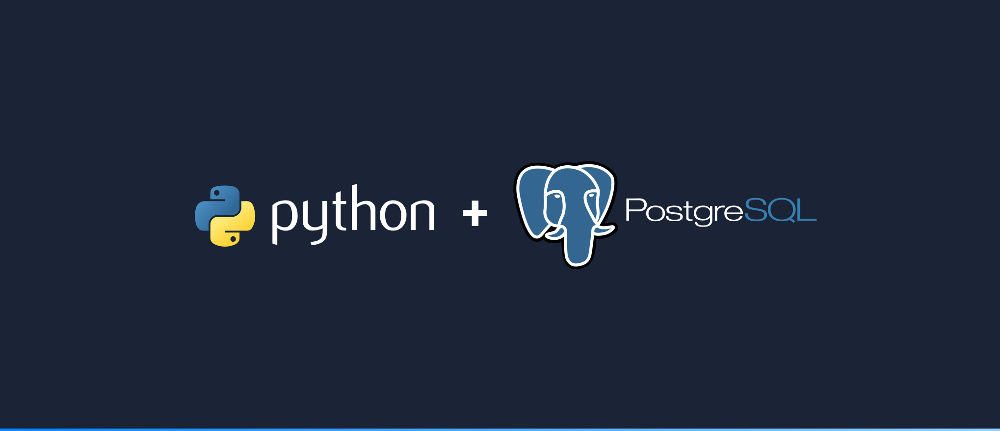

# PythonProjects 
Howdy, I don't know what to write here but maybe one day I'll come up with an inspirational quote.

PythonProjects is a repo with the code of all my different python projects that focus on creating something that 
can have real world value and or business value.

## Why am I doing this?
While learning how to code, there is a lot of emphasis on understanding the basics. Which is great for someone like 
me who is self-taught. But after you finish the tutorials, after you've watched all
the videos then what? 
You hit a road block. This repo is for those who have reached a certain level and are now ready to create 
and put into practice what you've learned. We won't be creating number guessing games or paper rock scissors scripts. That's BORING!

Instead, let's focus and dive deep into creating projects that are fun and challenging.
We are here to learn together and make mistakes together.

**Disclaimer**: I am not a professional. I did not study CS. 

## How can I follow along?
Check out my [YouTube](https://www.youtube.com/channel/UC2W1WYiSzQnQnUxhb8Xg99A) for videos of me working through these projects, making mistakes and learning as I go. 
Most of the videos will be screen recordings with an explanation of what I'm doing. One of my biggest frustrations is that the coding projects 
out there do not explain well. They simply type out the code and make a lot of assumptions. 
I will try my best to explain what I am doing in order to help you connect the dots. 

For each project, I will create a project plan via Notion in order to organize tasks, set goals and motivate us. Video [0] on my YouTube will always be 
a project introduction with a walk-through of the Notion Project Plan. 

**Disclaimer**: The only assumptions I need to make is that you know Python and SQL. For the project setup, I will provide resources needed to 
get you caught up and ready to start!

## Structure
Each project will contain a folder (Directory) containing the code needed to reproduce the final product. 
Feel free to copy and paste, take bits and modify. 

## Project 1: PythonPostgreSQL 

### What are we buiding? 
1. A program that queries a database and sends out formatted emails to a list of recipients. 
2. A Bot that scrapes Amazon, stores the gathered information in a database, we then query the database and automate reports. 
### What tools do I need? 
* Your favorite IDE. I will be using PyCharm Pro. 
* Create a Gmail account solely for this project. 
* pgAdmin and a local database set up on your machine.
  * [How to install Postgresql?](https://www.postgresql.org/)
  * [How to install pgAdmin](https://www.pgadmin.org/)
* A dataset to clean and query. (For Project 1)
  * [Data I used](https://catalog.data.gov/dataset/border-crossing-entry-data-683ae)
* Anything else, we will learn along the way. 

### Project Vision
In the end, I'd like to have a program that automatically sends reports every hour (time variable can change) with a nice
email body, a logo, formatted tables, etc. 
